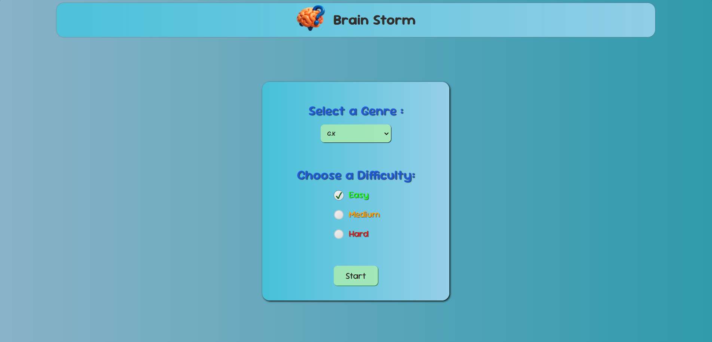
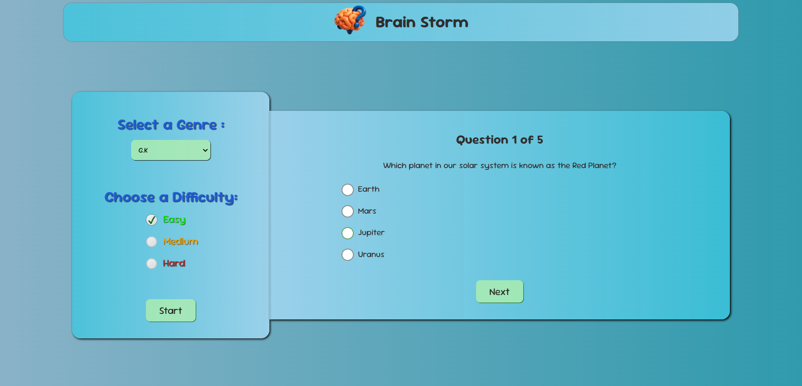

# 🧠 Brain Storm – Quiz App

An engaging and interactive **Quiz Application** built with **React**.  
Test your knowledge across multiple categories and difficulty levels while enjoying smooth animations, clean UI, and instant score tracking.

---

## 📸 Preview

  
  
_(Replace with an actual screenshot of your app inside `src/assets`)_

---

**GIF Preview:**  
  
_(GIF version auto-plays for a quick look)_

---

## 🚀 Features

- 🎯 **Multiple Categories** – Choose from various quiz genres
- 🎲 **Difficulty Levels** – Easy, Medium, Hard
- ✅ **Answer Selection** – Single-click answers
- 🚫 **Next button disabled until an answer is selected**
- 🔄 **Animations** – Smooth start-game and panel transitions
- 📊 **Score Tracking** – Live score updates & final results
- 📝 **Answer Review** – See your chosen answer alongside the correct one
- 📱 **Responsive Design** – Works on desktop and mobile

---

## 🛠️ Tech Stack

- **React** – Frontend UI and state management
- **HTML5 & CSS3** – Layout, styling & custom animations
- **JavaScript (ES6+)** – App logic
- _(Optional)_ Trivia API – For fetching live quiz data

---

## 🔧 Installation & Setup

1. **Clone the repository**

- git clone https://github.com/your-username/quiz-app.git
- cd quiz-app

2. **Install dependencies**

- npm install

3. **Start development server**

- npm run dev

Then open **[http://localhost:5173](http://localhost:5173)** in your browser.

---

---

## 💡 Usage

1. Select your category and difficulty from the dropdown menus
2. Click **Start** to load the quiz
3. Choose an answer and click **Next**
4. At the end, review your score and answers
5. Adjust settings and restart to try again

---

## 📜 License

This project is **open-source** and available under the **MIT License**.

---

## 🙌 Author

Developed by _[Santosh Chandra]_  
📧 *santohchandra609@email.com*  
🌐 Github – [https://github.com/SaNtOsH6099](#)
