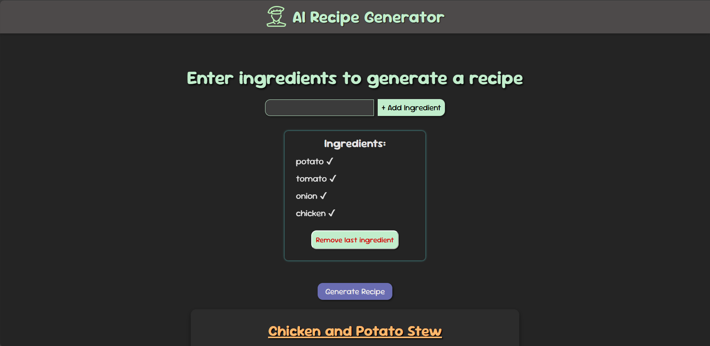

# 🍳 AI Recipe Generator

A fun and intelligent recipe generator built using **React** and **Vite**. It uses the **GroqCloud API** to generate recipes based on your input ingredients. The app includes dynamic recipe formatting, animated typing effects, and a responsive UI.

---

## 🚀 Features

- 🌟 AI-powered recipe creation
- 🧠 GroqCloud API integration
- 📝 Auto-formatted ingredients & instructions
- 🎯 Real-time typing animation for instructions
- 💡 Responsive and clean UI
- 🗑️ Option to remove ingredients dynamically

---

## 🖼️ Preview

---

## 🛠️ Tech Stack

- **React**
- **Vite**
- **Groq API**
- **CSS Modules**

---

## 📦 Installation

- git clone https://github.com/yourusername/ai-recipe-generator.git
- cd ai-recipe-generator
- npm install

---

## ⚙️ Setup API Key

1. In the root of your project, create a file named `.env`

2. Add your Groq API key inside it with the prefix `VITE_` like this:
   VITE_GROQ_API_KEY=your_groq_api_key_here

3. Save the file and restart your development server if it is running.

---

## 🏃 Running the App

This starts the development server (usually at [http://localhost:5173](http://localhost:5173)).

---

## Usage

1. Enter at least 3 ingredients.
2. Click the **Generate Recipe** button.
3. View the AI-generated, structured recipe with title, ingredients, steps, and tips.

---

## Contributing

Contributions, issues, and feature requests are welcome! Feel free to check issues or submit pull requests.

---
