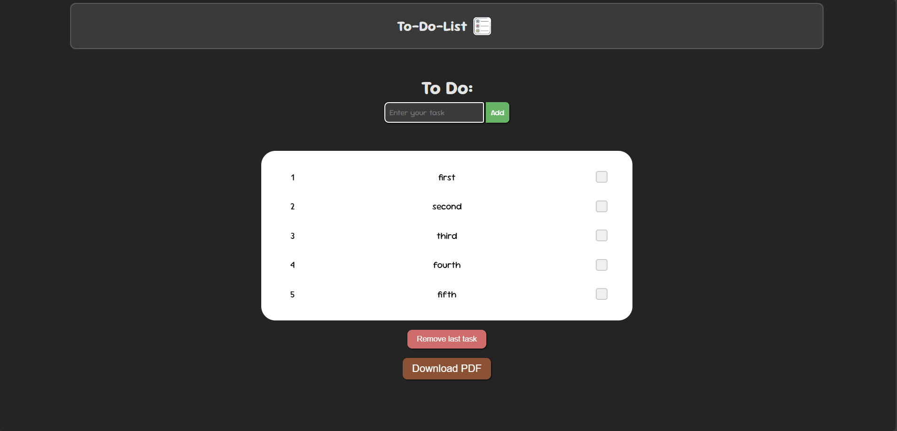

# 📝 To-Do List App

A simple and elegant To-Do List application built using **React**. This app allows users to:

- Add tasks dynamically
- Remove the last task
- Mark tasks as completed (via checkbox)
- Download the list as a PDF

## 📸 Preview



## 🚀 Features

- 🧾 Add new tasks
- ✅ Mark tasks as done
- ❌ Remove the last task
- 📥 Download the entire task list as a PDF
- 🎨 Stylish and dark-themed UI

## 🛠️ Tech Stack

- **React**
- **HTML & CSS**
- **jsPDF** (for generating PDF)

## 🔧 Installation

1. **Clone the repository:**

   ```bash
   git clone https://github.com/your-username/todo-list-app.git
   cd todo-list-app
   ```
